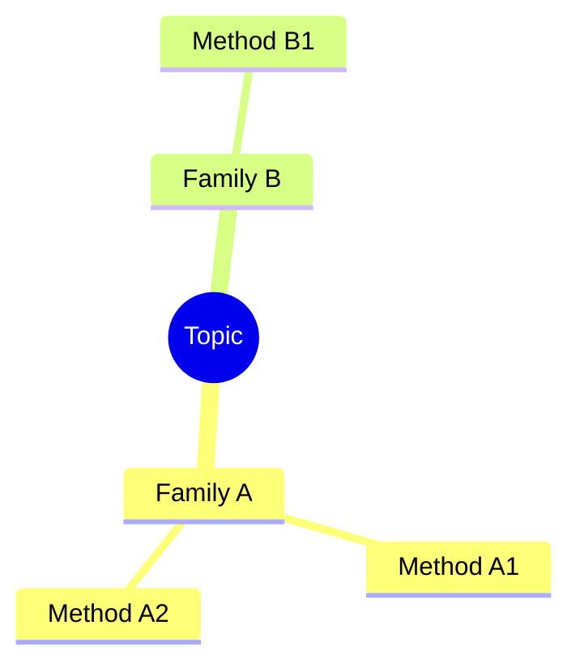

# Taxonomy Template

推荐先给一个树，再补解释：

```markdown
## Taxonomy

- Level 1
  - Level 2
    - Representative methods
```

或者：


```mermaid
mindmap
  root((Topic))
    Family A
      Method A1
      Method A2
    Family B
      Method B1
```

解释分类时至少回答：

- 分类维度是什么
- 为什么这样分
- 哪些类别边界模糊
